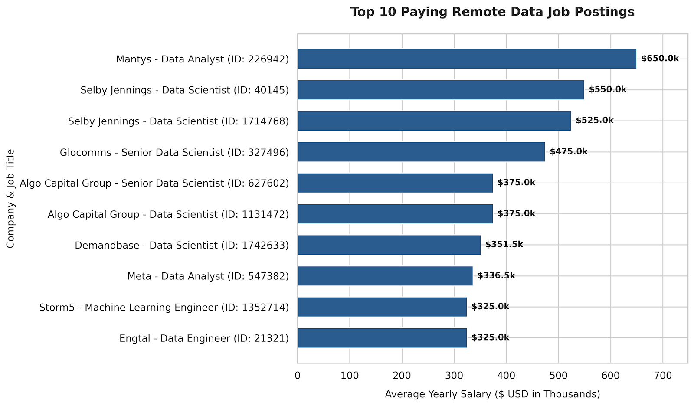

# Data Analyst Job Market Analysis

## Introduction
This project explores the remote Data Analyst job market to uncover high-paying roles, top-demanded skills, and the most optimal technologies to learn. 

**Core Questions Addressed:**
1. What are the top-paying jobs for Data Analysts?
2. What skills are required for these top-paying roles?
3. What are the most in-demand skills for Data Analysts?
4. What are the top skills associated with higher salaries?
5. What are the most optimal skills to learn (high demand + high salary)?

---

## Background
The goal of this project is to guide career development by identifying strategic learning priorities in data analytics. The dataset consists of global job postings, filtering specifically for remote (`work_from_home`) roles with verified annual salary data.

---

## Tools I Used
* **SQL (PostgreSQL):** Primary language used to query, join, aggregate, and analyze job market data.
* **Database Management System (PostgreSQL / DBeaver):** Executed CTEs, aggregate functions (`COUNT`, `AVG`), and conditional filtering (`HAVING`, `WHERE`).
* **Git & GitHub:** For project documentation and version control.
  **Visiual Studio Code : My go-to for database management and executing SQL queries.

---

## The Analysis

### 1. Top-Paying Data Analyst Jobs
Extracted the top 10 highest-paying remote Data Analyst roles, filtering out postings without explicit salary figures (`salary_year_avg IS NOT NULL`).

````sql

SELECT
    job_id,
    job_title_short,
    company_dim.name AS company_name,
    job_location,
    job_schedule_type,
    job_posted_date,
    salary_year_avg
FROM 
    job_postings_fact
LEFT JOIN company_dim ON job_postings_fact.company_id = company_dim.company_id
WHERE 
    salary_year_avg IS NOT NULL AND
    job_location = 'Anywhere' AND
    job_work_from_home IS TRUE
ORDER BY
    salary_year_avg DESC
LIMIT 10;

````


*** The visualization below displays the top 10 highest-paying remote data job postings from your SQL query result. ***




### 2. Skills Required for Top-Paying Roles
Joined top job postings with required skills to identify what high-paying employers look for in candidates.

````sql
WITH top_paying_jobs AS (
    SELECT
        job_id,
        job_title_short,
        company_dim.name AS company_name,
        salary_year_avg
    FROM 
        job_postings_fact
    LEFT JOIN company_dim ON job_postings_fact.company_id = company_dim.company_id
    WHERE 
        salary_year_avg IS NOT NULL AND
        job_work_from_home = TRUE
    ORDER BY
        salary_year_avg DESC
    LIMIT 10
)

SELECT 
    top_paying_jobs.job_id,
    top_paying_jobs.job_title_short,
    top_paying_jobs.company_name,
    top_paying_jobs.salary_year_avg,
    skills_dim.skills
FROM 
    top_paying_jobs
INNER JOIN skills_job_dim ON top_paying_jobs.job_id = skills_job_dim.job_id
INNER JOIN skills_dim ON skills_job_dim.skill_id = skills_dim.skill_id
ORDER BY
    top_paying_jobs.salary_year_avg DESC;
    
 ````

The chart below illustrates the frequency of technical skills required across the top-paying remote data roles from your dataset. 


### 3. Most In-Demand Skills
Aggregated total posting counts per skill to determine which technologies appear most frequently across remote listings.

````sql
SELECT
    skills_dim.skills,
    COUNT(skills_dim.skills) AS skill_count
FROM 
    skills_job_dim  
INNER JOIN skills_dim ON skills_job_dim.skill_id = skills_dim.skill_id
INNER JOIN job_postings_fact ON skills_job_dim.job_id = job_postings_fact.job_id
WHERE 
    job_postings_fact.job_title_short = 'Data Analyst' AND
    job_postings_fact.job_work_from_home = TRUE
GROUP BY
    skills_dim.skills
ORDER BY
    skill_count DESC
LIMIT 5


````
The chart below displays the top 5 most in-demand skills for remote Data Analyst roles based on total job posting mentions.  


### 4. Top Skills Based on Salary
Calculated the average annual salary associated with specific skills to locate high-value niche capabilities.
````sql
SELECT
    skills_dim.skills,
    ROUND(AVG(job_postings_fact.salary_year_avg), 0) AS avg_salary
FROM 
    skills_job_dim
INNER JOIN skills_dim ON skills_job_dim.skill_id = skills_dim.skill_id
INNER JOIN job_postings_fact ON skills_job_dim.job_id = job_postings_fact.job_id
WHERE 
    job_postings_fact.job_title_short = 'Data Analyst' AND
    job_postings_fact.salary_year_avg IS NOT NULL AND
    job_postings_fact.job_work_from_home = TRUE

GROUP BY
    skills_dim.skills
ORDER BY
    avg_salary DESC
LIMIT 25

````

The chart below illustrates the 25 highest-paying skills for remote Data Analyst roles based on average annual salary.  


### 5. Most Optimal Skills to Learn
Combined demand (`COUNT > 10`) and average salary (`AVG(salary_year_avg)`) to surface the sweet spot between market demand and financial reward.
````sql

SELECT 
    skills_dim.skills,
    COUNT(job_postings_fact.job_id) AS job_count,
    ROUND(AVG(job_postings_fact.salary_year_avg), 0) AS avg_salary
FROM 
    skills_job_dim
JOIN job_postings_fact ON skills_job_dim.job_id = job_postings_fact.job_id
JOIN skills_dim ON skills_job_dim.skill_id = skills_dim.skill_id
WHERE 
    job_postings_fact.job_title_short = 'Data Analyst' AND
    job_postings_fact.salary_year_avg IS NOT NULL AND
    job_postings_fact.job_work_from_home = TRUE 
GROUP BY 
    skills_dim.skills
HAVING
    COUNT(job_postings_fact.job_id) > 10 -- En az 10 ilanda geçen yetenekleri alır (gürültüyü engeller)
ORDER BY 
    avg_salary DESC,  job_count DESC
LIMIT 25
````

The visualizations below analyze the optimal skills for remote Data Analysts by combining high salary potential with minimum market demand (>10 job listings).  


---

## What I Learned
* **Complex SQL Queries:** Practical application of Common Table Expressions (CTEs), multi-table `INNER JOIN`s, and grouping aggregations (`GROUP BY`, `HAVING`).
* **Data Cleaning & Filtering:** Handled null values effectively and implemented location/schedule constraints (`job_work_from_home = TRUE`).
* **Market Insights:** Discovered how specialized technical skills directly correlate with compensation tiers in the remote labor market.

---

## Conclusions
* **Targeted Learning:** Prioritizing skills at the intersection of high frequency and premium salaries yields the highest ROI for professional development.
* **Remote Trends:** Remote data analyst positions offer competitive compensation packages, particularly when paired with high-demand query and visualization tooling.  
